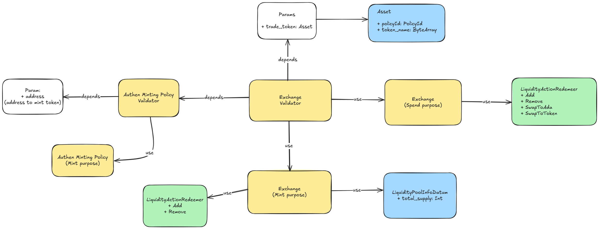

# The Simple DEX

## 1. Overview

- The Simple DEX uses Constant Product Formula (x * y = k). This formula, most simply expressed as x * y = k, states that trades must not change the product (k) of a pair’s reserve balances (x and y). Because k remains unchanged from the reference frame of a trade, it is often referred to as the invariant. This formula has the desirable property that larger trades (relative to reserves) execute at exponentially worse rates than smaller ones.

- Functional requirements:
    - Add liquidity: Users can add liquidity to the Pool Liquidity UTxO and mint LP token.
    - Remove liquidity: Users can remove liquidity from the Pool Liquidity UTxO by burn LP token.
    - Swap token: 
      - Users can swap token between token and ADA or vice versa.
      - Users can swap token to other token by using ADA as an intermediary.
      - Fee 0.3% of the amount of token to be swapped will be added to the Pool Liquidity UTxO.

- Non-functional requirements:
    - Security: No one can steal the assets in the Pool Liquidity UTxO.

- Limitation:
    - Each token is a distinct pool with different contracts.
    - Admin can create many Pool Liquidity UTxOs
    - Swap token to other token have high fee because it needs to swap to ADA first and then swap to the target token.

## 2. Architecture

There're 2 contracts in the The Simple DEX system:

- Authen Minting Policy: is responsible for creating Authen Token, which is used to verify the correctness of the 
  Pool Liquidity UTxO
- Exchange Contract: is responsible for trading between 2 tokens. It uses the Constant Product Formula (x * y = k) 
  to calculate the amount of token to be exchanged. The Exchange Contract is also responsible for add and 
  remove assets from the Pool Liquidity UTxO.

Flow of the system:
- Admin mints Authen Token by the Authen Minting Policy. 
- Admin sends Authen Token to the Exchange Contract to create the Pool Liquidity UTxO. 
- After the Pool Liquidity UTxO is created, user can use Pool Liquidity UTxO to:
    - Add liquidity to the Pool Liquidity UTxO and mint LP token.
    - Remove liquidity from the Pool Liquidity UTxO and burn LP token.
    - Swap token to ADA and vice versa.

## 3. Specification

### 3.1 Actors
- User: An entity who wants to interact with Liquidity Pool to deposit/withdraw liquidity or swap.
- Admin: The actor who can mint Authen Token to create the Pool Liquidity UTxO.

### 3.2 Tokens
- Authen Token: A token used to verify the correctness of the Pool Liquidity UTxO.
- Liquidity Pool token: Represents Liquidity Provider's share of pool, minted by Exchange Contract. Each pool has a different LP token.

### 3.3 Contracts

#### 3.3.1 Authen Minting Policy
Responsible for creating Authen Token, which is used to verify the correctness of the 
  Pool Liquidity UTxO
- Parameter: 
  - `address`: Admin's public key hash
- Datum: None
- Redeemer: None
- Validation:
  + Mint Authen Token if the address input UTxO is Admin's public key hash in the parameter.

#### 3.3.2 Exchange Contract
Responsible for trading between 2 tokens. It uses the Constant Product Formula (x * y = k) 
  to calculate the amount of token to be exchanged. The Exchange Contract is also responsible for creating, add and 
  remove assets from the Pool Liquidity UTxO.

- Parameter: 
  + `trade_token`: policy ID and token name.
  + `authen_token`: policy ID and token name.
- Datum: 
  + `total_supply`: total supply of the Liquidity Pool token.
- Redeemer:
  + `Add`: add liquidity to the Pool Liquidity UTxO and mint LP token.
  + `Remove`: remove liquidity from the Pool Liquidity UTxO and burn LP token.
  + `SwapToAda`: swap token to ADA.
  + `SwapToToken`: swap ADA to token.
- Validation:
  + `Add`:
    * Check inputs and outputs of transaction just have one Pool Liquidity UTxO has same policyId.
    * Calculate the amount of token to be added to the Pool Liquidity UTxO
    * Validate the ration between the trade token and ADA in inputs need to equal the ration of Liquidity Pool.
    * Validate the ration between the added token and the reserve token in LP equals the ration between the minted LP token and the total supply of LP token.
    * Validate the total supply of LP token is added correctly.
  + `Remove`:
    * Check inputs and outputs of transaction just have one Pool Liquidity UTxO has same policyId.
    * Calculate the amount of token to be removed to the Pool Liquidity UTxO
    * Validate the ration between the burned LP token and the total supply of LP token equals the ration of the removed token, ADA and the reserve token, ADA in LP.
    * Validate the total supply of LP token is removed correctly.
  + `SwapToAda`:
    * Check inputs and outputs of transaction just have one Pool Liquidity UTxO has same policyId.
    * Calculate the amount of ADA to be added and the amount of token to be removed in the Pool Liquidity UTxO.
    * Validate the amount of removed ADA need to match with the amount of added trade token.
    * Validate the total supply of LP token is not changed.
  + `SwapToToken`:
    * Check inputs and outputs of transaction just have one Pool Liquidity UTxO has same policyId.
    * Calculate the amount of token to be added and the amount of ADA to be removed in the Pool Liquidity UTxO.
    * Validate the amount of removed token need to match with the amount of added ADA.
    * Validate the total supply of LP token is not changed.

### 3.4 Transactions

#### 3.4.1 Mint Authen Token
Admin mints Authen Token to create the Pool Liquidity UTxO.

Transaction structure:
- Inputs:
    + Admin's UTxO
- Mint:
    + Redemeer: None
    + Token name: "AUTH_TOKEN"
    + Value: 1
- Outputs:
    + Admin's UTxO:
    + Value: 
      + 1 Authen Token

#### 3.4.2 Add Liquidity
User adds liquidity to the Pool Liquidity UTxO.

Transaction structure:
- Inputs:
    + User's UTxO:
      + Datum: None
      + Value: 
        + `x` trade token
        + `y` ADA
    + Pool Liquidity UTxO:
      + Datum:
        + total_supply: `C`
      + Value: 
        + `X` trade token
        + `Y` ADA
        + 1 Authen Token
      + Redeemer: `Add`

- Mint:
    + Redemeer: `Add`
    + Token name: `LP_TOKEN`
    + Value: 
        + `min(x/X, y/Y) * C` LP token

- Outputs:
    + User's UTxO:
      + Value:
          + `min(x/X, y/Y) * C` LP token
    + Pool Liquidity UTxO:
      + Value: 
          + `X + x` trade token
          + `Y + y` ADA
          + 1 Authen Token
      + Datum:
          + total_supply: `C + min(x/X, y/Y) * C`

#### 3.4.3 Remove Liquidity
User removes liquidity from the Pool Liquidity UTxO.

Transaction structure:
- Inputs:
    + User's UTxO:
      + Datum: none
      + Value: 
        + `c` LP token
    + Pool Liquidity UTxO:
      + Datum:
        + total_supply: `C`
      + Value: 
        + `X` trade token
        + `Y` ADA
        + 1 Authen Token
      + Redeemer: `Remove`
- Mint:
  + Redemeer: `Remove`
  + Token name: `LP_TOKEN`
  + Value: 
      + `-c` LP token

- Outputs:
    + User's UTxO:
      + Value:
          + `c/C * X` trade token
          + `c/C * Y` ADA
    + Pool Liquidity UTxO:
      + Value: 
          + `X - c/C * X` trade token
          + `Y - c/C * Y` ADA
          + 1 Authen Token
      + Datum:
          + total_supply: `C - c`

#### 3.4.4 Swap Token to ADA
User swaps token to ADA.
Transaction structure:
- Inputs:
    + User's UTxO:
      + Datum: none
      + Value: 
        + `x` trade token
    + Pool Liquidity UTxO:
      + Datum:
        + total_supply: `C`
      + Value: 
        + `X` trade token
        + `Y` ADA
        + 1 Authen Token
      + Redeemer: `SwapToAda`
- Outputs:
    + User's UTxO:
      + Value:
          + `x * Y * 1000 / (997 * (X + x))` ADA
    + Pool Liquidity UTxO:
      + Value: 
          + `X + x` trade token
          + `Y - (x * Y * 1000 / (997 * (X + x)))` ADA
          + 1 Authen Token
      + Datum:
          + total_supply: `C` 

#### 3.4.5 Swap ADA to Token
User swaps ADA to token.

Transaction structure:
- Inputs:
    + User's UTxO:
      + Datum: none
      + Value: 
        + `y` ADA
    + Pool Liquidity UTxO:
      + Datum:
        + total_supply: `C`
      + Value: 
        + `X` trade token
        + `Y` ADA
        + 1 Authen Token
      + Redeemer: `SwapToToken`
- Outputs:
    + User's UTxO:
      + Value:
          + `y * X * 1000 / (997 * (Y + y))` trade token
    + Pool Liquidity UTxO:
      + Value: 
          + `X - y * X * 1000 / (997 * (Y + y))` trade token
          + `Y + y` ADA
          + 1 Authen Token
      + Datum:
          + total_supply: `C`

#### 3.4.6 Swap Token to Token
User swaps token A to token B.

Transaction structure:
- Inputs:
    + User's UTxO:
      + Datum: none
      + Value: 
        + `x` trade token A
    + Pool Liquidity UTxO of token A:
      + Datum:
        + total_supply: `C1`
      + Value: 
        + `X1` token A
        + `Y1` ADA
        + 1 Authen Token
      + Redeemer: `SwapToAda`
    + Pool Liquidity UTxO of token B:
      + Datum:
        + total_supply: `C2`
      + Value: 
        + `X2` token B
        + `Y2` ADA
        + 1 Authen Token
      + Redeemer: `SwapToToken`

- Outputs:
    + User's UTxO:
      + Value:
          + `z * X2 * 1000 / (997 * (Y2 + z)` token B
    + Pool Liquidity UTxO of token A:
      + Value: 
          + `X1 + x` token A
          + `z` ADA (`z = x * Y1 * 1000 / (997 * (X1 + x))`)
          + 1 Authen Token
      + Datum:
          + total_supply: `C1` 
    + Pool Liquidity UTxO of token B:
      + Value: 
          + `X2 - z * X2 * 1000 / (997 * (Y2 + y))` token B
          + `Y2 + z` ADA
          + 1 Authen Token
      + Datum:
          + total_supply: `C2`